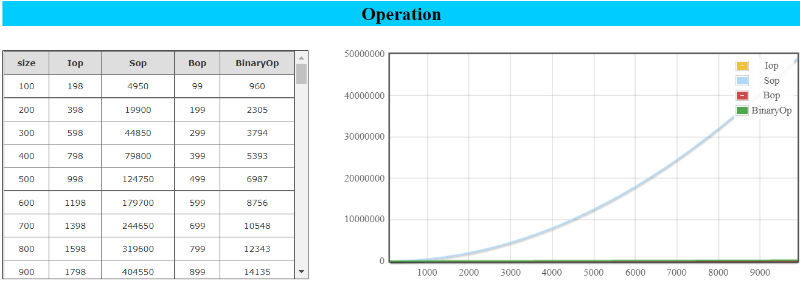
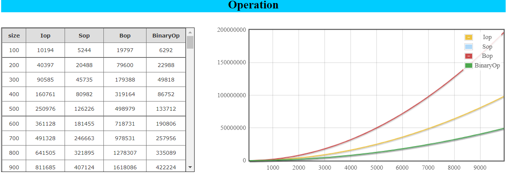

## Sorting Algorithms with O(n^2) time complexity
 ## 1.Insertion Sort:
 ###      1.1 How it works:
        -First item in the array is considered sorted so we take the second item and save it in the auxiliary variable.
        -Then we compare the saved value with his neighbors on the left side. If the saved
       value is smaller than the number we compared, we shift the compared number to the right in array.
        -We keep repeating the comparison and shifting until we reach the end of the array or the compared value is smaller or equal 
        with the saved value.
        - Then the save value is updated in the array at the correct position.

 

 ###      1.2 Complexity:
        -Time Complexity: O(N^2)
        -Auxiliary Space: O(1) 
        -Stable: Yes
 
 ## 2.Selection Sort:
 ###      2.1 How it works:
        -It searches for the minimum nr in the array and swap it with the element 
       at position i(i starts from 0), then i is incremented and the array is searched for
       the minimum value again.
        - After every swap the search is done faster because the elements from 0 to i are 
       sorted.

###       2.2 Complexity:
         Time Complexity: O(N^2)
         Auxiliary Space: O(1)
         Stable: No
  
 ## 3.Bubble Sort:
 ###      3.1 How it works:
        -Works by repeatedly swapping the adjacent elements if they are in the wrong order.
        -Bubble sort can have a stopping condition. If during a complete iteration no swap
        was made, then the array is sorted and the alghoritm can stop.

 ###      3.2 Complexity:
         Time Complexity: O(N^2)
         Auxiliary Space: O(1)
         Stable: Yes
  
  ## 4.Binary Insertion Sort:
 ###      4.1 How it works:
           - We divide the array into two arrays (sorted and unordered)
           - we iterate through the unordered array and use binary search to find the
          position of the elemnt from the unordered array in the sorted array.
 ###      4.2 Complexity:
           Time Complexity: O(N^2) and Ω(N log N)
           Stable: Yes
 ## What is "Profiler.h" ?
    A == assignment, C == comparison
    I used the profiler library to create a graph and represent the total number of 
    operations (assignments + comparisons) for each algorithm in every case(average, best and worst).

## Average case:
### We can clearly see that bubble is the slowest algorithm among them while the Binary Insertion sort is the fastest. Simple Insertion sort and Selection sort are quite close to each other.
Iop = Insertion sort operations          
Sop = Selection sort operations          
Bop = Bubble sort operations             
BinaryOp = Binary Insertion sort operations       
Size = Numbers sorted

## Best case:
### Selection sort is very slow compared with the other algorithms.
 

## Worst case:
### Bubble sort is the slowest in the worst case.
 
